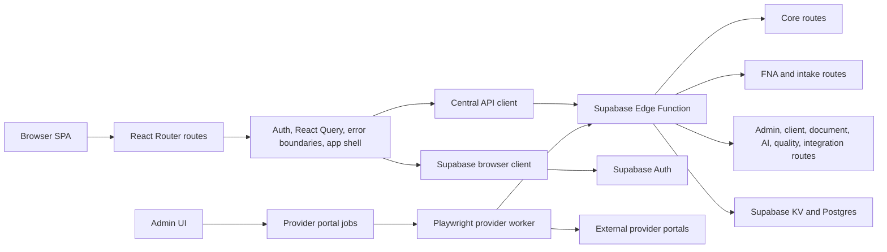

# Navigate Wealth

Navigate Wealth is a React, Vite, and TypeScript application for a South African financial advisory platform. It combines a public website, client portal, adviser/admin back office, financial-needs-analysis workflows, document and e-signature tooling, provider automation, SEO generation, and a remote Supabase Edge Function API.

The original Figma design handoff is available at:
https://www.figma.com/design/MjgXeyfZj3PfMPXteh1PiH/Navigate-Wealth

## Current Status

Before planning large changes, read the production status ledger:

- [`docs/PRODUCTION-READINESS.md`](docs/PRODUCTION-READINESS.md)

That document is the source of truth for what is landed, what is only proposed, known incidents, launch gates, and the next recommended engineering work. In particular:

- The app is a single-package React SPA, not a monorepo.
- The backend is the deployed Supabase Edge Function at `https://vpjmdsltwrnpefzcgdmz.supabase.co/functions/v1/make-server-91ed8379`.
- Routine local development does not require running a local backend.
- Client-led FNA intake is documented as production-grade for clients after the 2026-05-23 launch track.
- Form Prefill Tier A is documented as production-ready as of 2026-05-23.
- Issue Manager and quality snapshot ingestion are operational on the current production-readiness track.
- Some roadmap items remain intentional follow-up work, especially incremental backend route/module splitting and continued hardening.

## What The App Does

Navigate Wealth serves several audiences from one SPA:

| Audience            | Capabilities                                                                                                                                                                                                                                                                 |
| ------------------- | ---------------------------------------------------------------------------------------------------------------------------------------------------------------------------------------------------------------------------------------------------------------------------- |
| Public visitors     | Marketing pages, services pages, resources, articles, quote/contact flows, legal pages, sitemap, link-in-bio page, Ask Vasco, and SEO-friendly static output.                                                                                                                |
| Clients             | Authentication, onboarding, application status, dashboards, FNA intake, service-specific financial planning views, documents, communication, e-signature history, adviser details, profile, and security settings.                                                           |
| Advisers and admins | Client management, FNA modules, applications, submissions, tasks, notes, communication, calendar, resources, publications, compliance, reporting, product management, provider automation, e-signature preparation, AI management, Issue Manager, and audit/quality tooling. |
| Automation workers  | Provider portal jobs, form prefill, FNA intake backfill/UAT scripts, GitHub Actions dispatch, and OpenClaw gateway event intake.                                                                                                                                             |

Primary advice domains represented in the UI and backend include risk planning, medical aid, retirement planning, investment management, employee benefits, tax planning, and estate planning.

## Tech Stack

| Layer                    | Technology                                                                                     |
| ------------------------ | ---------------------------------------------------------------------------------------------- |
| Frontend runtime         | React 18, TypeScript, Vite 6, React Router 7                                                   |
| UI and styling           | Tailwind CSS 4, Radix UI primitives, lucide-react, custom design system components             |
| Data fetching            | TanStack React Query                                                                           |
| Auth and data platform   | Supabase Auth, Supabase client, Supabase Edge Functions, Supabase KV/Postgres-backed workflows |
| Backend runtime          | Supabase Edge Functions with Deno and Hono                                                     |
| Documents and signatures | pdf-lib, pdfjs-dist, jsPDF, docx, signpdf packages, e-sign route modules                       |
| Rich content             | Tiptap, react-quill-new, publications/resources modules                                        |
| Charts and analytics     | Recharts, Vercel Analytics, Vercel Speed Insights                                              |
| Browser automation       | Playwright for provider portal worker and E2E tests                                            |
| Testing and quality      | Vitest, Testing Library, Playwright, ESLint, Prettier, TypeScript, Deno check                  |

## High-Level Architecture



### Frontend Shell

The frontend entry path is:

```text
src/main.tsx
  -> src/App.tsx
  -> src/components/providers/AppProviders.tsx
  -> src/router/createAppRouter.tsx
  -> src/AppRoutes.tsx
```

Important shell behavior:

- `App.tsx` validates/logs environment information, installs global error handlers, reports runtime client issues, handles failed dynamic imports with a one-time reload, registers the PWA service worker, injects the manifest, and mounts Vercel Analytics/Speed Insights.
- `AppProviders.tsx` owns the global `QueryClient`, authentication provider, router provider, toast system, scroll restoration, inactivity management, image optimization, unsaved-changes registry, and nested error boundaries.
- `AppRoutes.tsx` lazily imports most pages to reduce initial bundle cost. It groups routes into public website routes, auth routes, onboarding/application routes, protected client dashboard routes, admin routes, and standalone functional routes such as request completion, newsletter confirmation, signing, and document verification.
- `vite.config.ts` defines the `@` alias, uses React SWC, Tailwind's Vite plugin, resolves `figma:asset/...` imports into `src/assets`, and manually chunks large vendor groups such as React, Supabase, forms, PDF, document, chart, and UI dependencies.

### Client State And API Access

The browser API path is intentionally centralized:

- `src/utils/supabase/info.tsx` resolves the Supabase project URL and anon key from `VITE_SUPABASE_*` environment variables, with hardcoded fallback values for bootstrapping.
- `src/utils/supabase/client.ts` creates a singleton Supabase browser client with persisted auth sessions and automatic token refresh.
- `src/utils/api/client.ts` builds requests to `/functions/v1/make-server-91ed8379`, attaches a Supabase bearer token when available, falls back to the anon key where appropriate, deduplicates refresh attempts, handles JSON and non-JSON responses, and dispatches a session-expired event when an authenticated session is no longer recoverable.
- React Query is configured globally with short stale times, finite retries, and special handling for 401/403 responses.

### Authentication Invariants

Authentication hydration is sensitive. Keep these invariants intact:

- Hydration should flow from `onAuthStateChange` events such as `INITIAL_SESSION` and `SIGNED_IN`.
- Do not reintroduce a parallel cold-start `getSession()` bootstrap path without explicit review.
- During auth hydration, pass the Supabase `session.user` hint into `loadUserProfile(...)` so the hot path does not stack a redundant `auth.getUser()` call.
- `refreshUser` may omit the hint.
- Keep these regression tests green:
  - `src/utils/auth/__tests__/loadUserProfile.sessionHint.test.ts`
  - `src/components/auth/__tests__/authContext.invariants.test.ts`

### Backend Edge Function

The deployed backend is a Supabase Edge Function:

```text
supabase/functions/make-server-91ed8379/index.ts
  -> src/supabase/functions/server/index.tsx
```

The server uses Hono and lazy route mounting:

- `mount-core.ts` registers core auth, profile, security, setup, sitemap, RSS, integration, Honeycomb, and KV routes.
- `mount-fna.ts` registers FNA, FNA intake, batch status, retirement, estate, tax, medical, investment, and risk-planning routes.
- `mount-modules.ts` registers the larger operational surface: requests, e-sign, resources, reporting, publications, auto-content, clients, communication, product management, social marketing, calendar, compliance, advice engine, applications, newsletter, documents, AI advisor/intelligence, tasks, goals, quality issues, LinkedIn, Vasco, OpenClaw, form prefill, form templates, and related modules.

Important backend behavior:

- Health endpoints are unauthenticated:
  - `/make-server-91ed8379`
  - `/make-server-91ed8379/health`
  - `/make-server-91ed8379/health/ready`
- Business routes should enforce auth at router scope through `requireAuth` or stricter route-specific middleware.
- Every response carries or echoes an `x-request-id` header.
- CORS is controlled by `NW_ALLOWED_ORIGINS`. If unset, the function deliberately reflects browser origins and logs a warning. Do not casually remove this fallback; it exists to avoid another production lockout, and auth is the real security boundary.

## Repository Layout

```text
.
|-- src/
|   |-- App.tsx                         # App-level bootstrapping and global handlers
|   |-- AppRoutes.tsx                   # Route definitions and lazy page loading
|   |-- assets/                         # Imported Figma/exported image assets
|   |-- components/
|   |   |-- admin/modules/              # Admin/adviser operational modules
|   |   |-- auth/                       # Auth context, guards, login/session flows
|   |   |-- client/                     # Client-facing FNA, communication, e-sign areas
|   |   |-- layout/                     # Public/dashboard layout
|   |   |-- pages/                      # Route-level public and portal pages
|   |   |-- providers/                  # AppProviders and global provider wiring
|   |   |-- shared/                     # Shared UI/application helpers
|   |   `-- ui/                         # Reusable UI primitives
|   |-- config/                         # Frontend environment helpers
|   |-- middleware/                     # Route policy helpers and tests
|   |-- router/                         # Data-router wrapper
|   |-- services/                       # Browser-side domain services
|   |-- shared/                         # Shared domain libraries and pure logic
|   |-- supabase/functions/server/      # Hono Edge Function implementation
|   |-- styles/                         # Styling support
|   |-- types/                          # Shared TypeScript types
|   `-- utils/                          # API, auth, Supabase, formatting, quality utilities
|-- supabase/
|   |-- functions/make-server-91ed8379/ # Supabase deploy entrypoint
|   |-- migrations/                     # Postgres migrations
|   `-- cron/                           # Cron SQL and smoke-test notes
|-- scripts/                            # SEO, provider worker, UAT, migration, smoke scripts
|-- docs/                               # Production/readiness, launch, worker, gateway docs
|-- e2e/                                # Playwright specs
|-- public/                             # Public assets, robots, service worker, generated SEO output
|-- .github/workflows/                  # Quality and deploy workflows
|-- vite.config.ts
|-- vitest.config.ts
|-- playwright.config.ts
|-- vercel.json
`-- package.json
```

## Getting Started

### Prerequisites

- Node.js 20 is recommended because GitHub Actions uses Node 20.
- npm is used for dependency management.
- No local Supabase backend is required for normal frontend development.
- Deno is required only when running the Edge Function typecheck.
- Playwright browser binaries are required for E2E tests and provider automation.

### Install

```bash
npm install
```

For CI-like installs, use:

```bash
npm ci
```

### Environment

Copy the example file if you need local overrides:

```bash
cp .env.example .env.local
```

On Windows PowerShell:

```powershell
Copy-Item .env.example .env.local
```

The app can boot without local Supabase variables because `src/utils/supabase/info.tsx` contains fallback project values. For production and preview deployments, set explicit `VITE_SUPABASE_URL`, `VITE_SUPABASE_PROJECT_ID`, and `VITE_SUPABASE_ANON_KEY` values in the host environment.

Never put secrets in `VITE_*` variables. Vite embeds those values into the browser bundle.

### Start The Dev Server

```bash
npm run dev
```

Vite serves the app at:

```text
http://localhost:3000/
```

## Scripts

The main scripts in the current `package.json` are:

| Task                                       | Command                                                                      |
| ------------------------------------------ | ---------------------------------------------------------------------------- |
| Start Vite dev server                      | `npm run dev`                                                                |
| Production build with SEO generation       | `npm run build`                                                              |
| Verify SEO output only                     | `npm run seo:verify`                                                         |
| Run Vitest once                            | `npm test`                                                                   |
| Run Vitest in watch mode                   | `npm run test:watch`                                                         |
| Run Playwright E2E tests                   | `npm run test:e2e`                                                           |
| Run Playwright headed                      | `npm run test:e2e:headed`                                                    |
| Typecheck SPA code                         | `npm run typecheck`                                                          |
| Typecheck Vercel middleware                | `npm run typecheck:middleware`                                               |
| Typecheck Supabase Edge code with Deno     | `npm run typecheck:deno`                                                     |
| Run ESLint                                 | `npm run lint`                                                               |
| Run ESLint autofix                         | `npm run lint:fix`                                                           |
| Format with Prettier                       | `npm run format`                                                             |
| Check Prettier formatting                  | `npm run format:check`                                                       |
| Optimize images                            | `npm run optimize:images`                                                    |
| Capture optional UI inspection screenshot  | `npm run ui:inspect -- --path /your-route --output tmp/ui-inspect/check.png` |
| Run provider worker once                   | `npm run provider:sync`                                                      |
| Watch provider worker in headed/debug mode | `npm run provider:watch`                                                     |
| Run long-poll provider worker              | `npm run provider:worker`                                                    |
| Backfill FNA intake KV to Postgres         | `npm run fna-intake:backfill`                                                |
| Bootstrap FNA UAT actors                   | `npm run fna-intake:bootstrap-uat`                                           |
| Run FNA intake API UAT                     | `npm run fna-intake:api-uat`                                                 |
| Generate FNA intake UAT report             | `npm run fna-intake:uat-report`                                              |
| Run form prefill API smoke                 | `npm run form-prefill:smoke`                                                 |
| Run form prefill E2E smoke                 | `npm run form-prefill:e2e`                                                   |
| Migrate form templates to storage          | `npm run form-prefill:migrate-templates`                                     |

## Build And SEO Pipeline

The production build does more than compile the SPA:

```bash
npm run build
```

Build sequence:

1. `scripts/generate-seo-files.mjs` generates `sitemap.xml`, `robots.txt`, and SEO route data.
2. `vite build` compiles the SPA into `dist/`.
3. `scripts/apply-static-seo.mjs` prerenders route-level `<head>` metadata and crawler-friendly static `<noscript>` body content.
4. `scripts/verify-seo-build.mjs` validates the generated output.

SEO-related environment variables:

| Variable                                                                     | Effect                                                                                                                                                |
| ---------------------------------------------------------------------------- | ----------------------------------------------------------------------------------------------------------------------------------------------------- |
| `SITE_URL` or `VITE_SITE_URL`                                                | Base site URL used by SEO scripts. Defaults to the production site when unset.                                                                        |
| `GOOGLE_SITE_VERIFICATION` or `VITE_GOOGLE_SITE_VERIFICATION`                | Injects a Google Search Console verification meta tag into generated pages.                                                                           |
| `SEO_REQUIRE_ARTICLES`                                                       | `1`/`true` hard-fails if article fetch fails; `0`/`false` forces lenient behavior. When unset, CI/Vercel are strict and local development is lenient. |
| `SUPABASE_FUNCTIONS_BASE_URL`                                                | Allows SEO scripts to fetch published article/resource data from a specific Edge Function base URL.                                                   |
| `PUBLIC_SUPABASE_ANON_KEY`, `SUPABASE_ANON_KEY`, or `VITE_SUPABASE_ANON_KEY` | Anon key used by build-time article/resource fetches when needed.                                                                                     |

To verify Google Search Console:

1. Set `GOOGLE_SITE_VERIFICATION` in Vercel.
2. Redeploy.
3. Complete verification in Search Console.
4. Submit `https://www.navigatewealth.co/sitemap.xml`.

## Environment Variable Model

`.env.example` documents the variables the code reads. The major groups are:

| Group                  | Examples                                                                                                              | Where they belong                                                               |
| ---------------------- | --------------------------------------------------------------------------------------------------------------------- | ------------------------------------------------------------------------------- |
| Frontend public values | `VITE_SUPABASE_URL`, `VITE_SUPABASE_ANON_KEY`, `VITE_SITE_URL`, `VITE_FNA_INTAKE_ENABLED`                             | Vercel/project build environment and optional `.env.local`. Must be non-secret. |
| Build and SEO          | `SITE_URL`, `SEO_REQUIRE_ARTICLES`, `GOOGLE_SITE_VERIFICATION`, `SUPABASE_FUNCTIONS_BASE_URL`                         | Local shell, Vercel build env, or CI.                                           |
| Edge Function secrets  | `SUPABASE_SERVICE_ROLE_KEY`, `NW_ALLOWED_ORIGINS`, `SUPER_ADMIN_PASSWORD`, `CRON_SECRET`, provider/API keys           | Supabase Edge Function secrets, not browser env.                                |
| AI and integrations    | `OPENAI_API_KEY`, `NW_GOOGLE_AI_API_KEY`, `LINKEDIN_CLIENT_SECRET`, `HONEYCOMB_API_KEY`, `NW_OPENCLAW_GATEWAY_SECRET` | Supabase secrets or integration host secrets, depending on consumer.            |
| Provider portal worker | `NW_API_BASE`, `NW_API_AUTH_TOKEN`, `NW_PORTAL_WORKER_SECRET`, `NW_PROVIDER_*`, `NW_PLAYWRIGHT_*`                     | Worker host, local debugging shell, or GitHub Actions.                          |
| E2E and smoke tests    | `E2E_FNA_ADVISER_EMAIL`, `E2E_FNA_ADVISER_PASSWORD`, `E2E_FNA_CLIENT_ID`, `ADMIN_EMAIL`, `ADMIN_PASSWORD`             | Local ignored env files or GitHub Actions secrets.                              |

## Feature Flags

| Flag                      | Purpose                                                                                                           |
| ------------------------- | ----------------------------------------------------------------------------------------------------------------- |
| `VITE_FNA_INTAKE_ENABLED` | Enables the client-led FNA intake UI. Production launch documentation records this as enabled after launch gates. |

Edge-side FNA intake storage flags also exist:

| Secret                  | Purpose                                                          |
| ----------------------- | ---------------------------------------------------------------- |
| `FNA_INTAKE_DUAL_WRITE` | Mirrors writes during KV to Postgres migration/cutover windows.  |
| `FNA_INTAKE_READ_FROM`  | Selects canonical read source, usually `postgres` after cutover. |

## Testing And Quality

Use the narrowest reliable verification for the change:

- Pure logic, services, route contracts, and component behavior: `npm test`
- Auth hydration regressions: `npm test -- src/utils/auth/__tests__/loadUserProfile.sessionHint.test.ts src/components/auth/__tests__/authContext.invariants.test.ts`
- SPA TypeScript: `npm run typecheck`
- Middleware TypeScript: `npm run typecheck:middleware`
- Supabase Edge Function TypeScript/Deno graph: `npm run typecheck:deno`
- Lint: `npm run lint`
- Formatting: `npm run format:check`
- Browser flows: `npm run test:e2e`
- Optional rendered UI screenshot inspection: `npm run ui:inspect -- --path /route --output tmp/ui-inspect/check.png`

GitHub's `Quality Check` workflow runs build, Vitest with coverage, SPA typecheck, ESLint, Prettier check, middleware typecheck, Deno edge-code typecheck with a ratchet baseline, focused FNA/form-prefill tests, npm audit capture, and quality issue publishing.

## Deployment

### Frontend

The frontend is built by Vite and deployed from `dist/`. `vercel.json` configures:

- `dist` as the output directory.
- A canonical host redirect from `navigatewealth.co` to `www.navigatewealth.co`.
- Long-lived immutable caching for `/assets/*`.
- SPA rewrites to `index.html`.
- `X-Robots-Tag: noindex, nofollow` for app/admin/auth/dashboard-style routes that should not be indexed.

### Supabase Edge Function

Deploy the backend function with:

```bash
npx supabase functions deploy make-server-91ed8379 --project-ref vpjmdsltwrnpefzcgdmz --use-api --workdir .
```

The GitHub workflow at `.github/workflows/deploy-supabase-function.yml` deploys the function on relevant pushes to `main` when `SUPABASE_ACCESS_TOKEN` is configured.

### Database Migrations

Migrations live in `supabase/migrations/`. Current notable migrations include:

- `20260420000001_esign_core_tables.sql`
- `20260520000001_fna_intake_sessions.sql`

Apply database migrations deliberately and verify against staging/disposable environments before production promotion.

## Provider Portal Worker

Provider portal automation lives outside the Edge Function because Playwright requires a Node process with browser binaries.

Key files and docs:

- `scripts/provider-portal-worker.mjs`
- `Dockerfile.portal-worker`
- `docs/provider-portal-worker.md`
- `docs/provider-automation-golden-flows.md`
- `.github/workflows/provider-portal-worker.yml` if present in the current branch

High-level flow:

```text
admin creates portal job
  -> Edge Function stores/dispatches job
  -> GitHub Actions or hosted worker starts Playwright
  -> worker logs into provider portal
  -> OTP/search/extract/validate/stage
  -> worker reports status and artifacts back through the API
```

Allan Gray RA is the protected golden regression flow. Provider-specific changes should preserve Allan Gray behavior unless the task explicitly targets Allan Gray.

## Security And Operational Notes

- Do not commit `.env.local`, service-role keys, provider credentials, admin passwords, GitHub tokens, or worker secrets.
- Treat every `VITE_*` value as public.
- Supabase anon keys are publishable but still rely on RLS/auth/API checks.
- `SUPABASE_SERVICE_ROLE_KEY` belongs only in Supabase secrets, controlled scripts, or secure CI/ops contexts.
- CORS is defense-in-depth, not authorization. Business routes must require auth even if `NW_ALLOWED_ORIGINS` is configured.
- The permissive CORS fallback is intentional when `NW_ALLOWED_ORIGINS` is unset; do not tighten it as an incidental cleanup.
- Health endpoints are unauthenticated by design; business endpoints should not be.
- PII, financial data, e-signature artifacts, and provider credentials should not appear in screenshots, logs, commits, or issue payloads unless deliberately redacted.
- Runtime client issues and CI quality snapshots feed the Issue Manager; preserve useful request IDs and error context without leaking secrets.

## Important Documentation

| Document                                                                                     | Purpose                                                        |
| -------------------------------------------------------------------------------------------- | -------------------------------------------------------------- |
| [`docs/PRODUCTION-READINESS.md`](docs/PRODUCTION-READINESS.md)                               | Authoritative status ledger, incidents, blockers, and roadmap. |
| [`src/guidelines/Guidelines.md`](src/guidelines/Guidelines.md)                               | Architecture and engineering guidelines.                       |
| [`docs/fna-intake-launch-checklist.md`](docs/fna-intake-launch-checklist.md)                 | FNA intake launch, rollback, and monitoring checklist.         |
| [`docs/fna-intake-support-runbook.md`](docs/fna-intake-support-runbook.md)                   | Adviser/support operations for client-led FNA intake.          |
| [`docs/fna-intake-uat-signoff.md`](docs/fna-intake-uat-signoff.md)                           | FNA intake UAT matrix and sign-off.                            |
| [`docs/form-prefill-production-launch-plan.md`](docs/form-prefill-production-launch-plan.md) | Form Prefill launch/hardening plan.                            |
| [`docs/form-prefill-uat-signoff.md`](docs/form-prefill-uat-signoff.md)                       | Form Prefill UAT evidence.                                     |
| [`docs/provider-portal-worker.md`](docs/provider-portal-worker.md)                           | Provider worker architecture, required secrets, and debugging. |
| [`docs/provider-automation-golden-flows.md`](docs/provider-automation-golden-flows.md)       | Protected provider automation regression flows.                |
| [`docs/openclaw-gateway.md`](docs/openclaw-gateway.md)                                       | OpenClaw gateway contract and capability model.                |

## Contributing Guidelines

1. Read `docs/PRODUCTION-READINESS.md` before large changes.
2. Check the current `package.json` before assuming which scripts exist.
3. Keep changes scoped to the requested domain.
4. Preserve auth hydration invariants and run the auth regression tests for auth/session work.
5. For Edge Function changes, run focused route tests and consider `npm run typecheck:deno`.
6. For public route, SEO, or Vercel route changes, run `npm run build` or at least `npm run seo:verify`.
7. For provider automation changes, use the golden-flow docs and keep provider-specific behavior behind provider boundaries.
8. Avoid regenerating SEO files, screenshots, reports, coverage, or build outputs unless they are part of the task.
9. Do not use `npm run ui:inspect` as a default sign-off step; reserve it for explicit UI verification or practical browser-level checks.

## Troubleshooting

| Symptom                                    | Things to check                                                                                                                         |
| ------------------------------------------ | --------------------------------------------------------------------------------------------------------------------------------------- |
| Login bounces back to login                | Preserve the single auth hydration pipeline; check Supabase session state, `AuthContext`, `loadUserProfile`, and auth regression tests. |
| Browser says "Network error" for API calls | Check the Edge Function URL, `NW_ALLOWED_ORIGINS`, deployment status, request IDs, and Supabase function logs.                          |
| Build fails while fetching articles        | Set or review `SEO_REQUIRE_ARTICLES`; local builds can be lenient, CI/Vercel are strict by default.                                     |
| Public route metadata looks wrong          | Check `seo-route-manifest.json`, SEO scripts, route manifest data, and `npm run seo:verify`.                                            |
| Provider automation stalls on OTP          | Use provider worker debug artifacts, traces, videos, and live screenshots; see `docs/provider-portal-worker.md`.                        |
| Deno typecheck reports many errors         | Compare against `.deno-check-baseline`; the CI gate ratchets against the committed floor while the backlog is burned down.              |

## License

This repository is marked `"private": true` in `package.json` and does not currently include a public license file. Treat the codebase as proprietary unless the project owner adds an explicit license.
