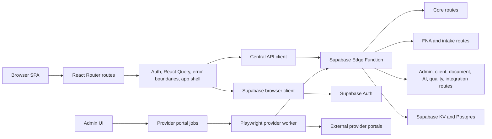

# Architecture Overview

**What this is.** How a request travels through Navigate Wealth, from the browser
to the Edge Function to storage, and the invariants that hold each leg together.
Read this before changing the app shell, the API client, or route mounting.

Moved here from the README, which had grown into five documents in one file.
Individual subsystems have their own write-ups in this folder.



## Frontend Shell

The frontend entry path is:

```text
src/main.tsx
  -> src/App.tsx
  -> src/components/providers/AppProviders.tsx
  -> src/router/createAppRouter.tsx
  -> src/AppRoutes.tsx
```

Important shell behavior:

- `App.tsx` validates/logs environment information, installs global error handlers, reports runtime client issues, handles failed dynamic imports with a one-time reload, registers the PWA service worker, injects the manifest, and mounts Vercel Analytics/Speed Insights.
- `AppProviders.tsx` owns the global `QueryClient`, authentication provider, router provider, toast system, scroll restoration, inactivity management, image optimization, unsaved-changes registry, and nested error boundaries.
- `AppRoutes.tsx` lazily imports most pages to reduce initial bundle cost. It groups routes into public website routes, auth routes, onboarding/application routes, protected client dashboard routes, admin routes, and standalone functional routes such as request completion, newsletter confirmation, signing, and document verification.
- `vite.config.ts` defines the `@` alias, uses React SWC, Tailwind's Vite plugin, resolves `figma:asset/...` imports into `src/assets`, and manually chunks large vendor groups such as React, Supabase, forms, PDF, document, chart, and UI dependencies.

## Client State And API Access

The browser API path is intentionally centralized:

- `src/utils/supabase/info.tsx` resolves the Supabase project URL and anon key from `VITE_SUPABASE_*` environment variables, with hardcoded fallback values for bootstrapping.
- `src/utils/supabase/client.ts` creates a singleton Supabase browser client with persisted auth sessions and automatic token refresh.
- `src/utils/api/client.ts` builds requests to `/functions/v1/make-server-91ed8379`, attaches a Supabase bearer token when available, falls back to the anon key where appropriate, deduplicates refresh attempts, handles JSON and non-JSON responses, and dispatches a session-expired event when an authenticated session is no longer recoverable.
- React Query is configured globally with short stale times, finite retries, and special handling for 401/403 responses.

## Authentication Invariants

Authentication hydration is sensitive. Keep these invariants intact:

- Hydration should flow from `onAuthStateChange` events such as `INITIAL_SESSION` and `SIGNED_IN`.
- Do not reintroduce a parallel cold-start `getSession()` bootstrap path without explicit review.
- During auth hydration, pass the Supabase `session.user` hint into `loadUserProfile(...)` so the hot path does not stack a redundant `auth.getUser()` call.
- `refreshUser` may omit the hint.
- Keep these regression tests green:
  - `src/utils/auth/__tests__/loadUserProfile.sessionHint.test.ts`
  - `src/components/auth/__tests__/authContext.invariants.test.ts`

## Backend Edge Function

The deployed backend is a Supabase Edge Function:

```text
supabase/functions/make-server-91ed8379/index.ts
  -> src/supabase/functions/server/index.tsx
```

The server uses Hono and lazy route mounting:

- `mount-core.ts` registers core auth, profile, security, setup, sitemap, RSS, integration, Honeycomb, and KV routes.
- `mount-fna.ts` registers FNA, FNA intake, batch status, retirement, estate, tax, medical, investment, and risk-planning routes.
- `mount-modules.ts` registers the larger operational surface: requests, e-sign, resources, reporting, publications, auto-content, clients, communication, product management, social marketing, calendar, compliance, advice engine, applications, newsletter, documents, AI advisor/intelligence, tasks, goals, quality issues, LinkedIn, Vasco, OpenClaw, form prefill, form templates, and related modules.

Important backend behavior:

- Health endpoints are unauthenticated:
  - `/make-server-91ed8379`
  - `/make-server-91ed8379/health`
  - `/make-server-91ed8379/health/ready`
- Business routes should enforce auth at router scope through `requireAuth` or stricter route-specific middleware.
- Every response carries or echoes an `x-request-id` header.
- CORS is controlled by `NW_ALLOWED_ORIGINS`. If unset, the function deliberately reflects browser origins and logs a warning. Do not casually remove this fallback; it exists to avoid another production lockout, and auth is the real security boundary.
