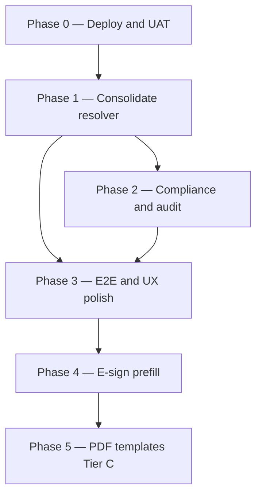

# Form Prefill — Production Launch Plan

**Purpose:** Close the gap between **Tier A code landed (2026-05-23)** and **production-grade** at the same bar as FNA Intake: deployed backend, UAT sign-off, governed audit, trustworthy adviser UX, and a separate PDF track.

**Prerequisite:** Tier A implementation is in the repo. See `docs/PRODUCTION-READINESS.md` Section 10a and `docs/form-prefill-uat-signoff.md`.

---

## Current state (honest)

| Area                                      | Status                                                                     |
| ----------------------------------------- | -------------------------------------------------------------------------- |
| Shared resolver + review UI               | Landed — all 6 FNA Step 1 entry points                                     |
| Auth + rate limits                        | Landed — adviser/admin JWT, `/prefill/*` rate limits                       |
| Registry                                  | Partial — high-value fields only (~8–12 per domain)                        |
| Legacy `autoPopulateFromProfile()` routes | Still exist — duplicate data path                                          |
| Audit                                     | KV-only — no query UI or retention                                         |
| Deploy + UAT                              | **Not done** — blocking production label                                   |
| E2E                                       | Minimal smoke spec — not full wizard apply path                            |
| PDF templates                             | Partial — picker, template preview, document attach; templates still in KV |
| E-sign tokens (Tier B)                    | Not launched                                                               |
| Client drawer prefill entry               | Not built                                                                  |

---

## Launch phases



---

## Phase 0 — Deploy and UAT (blocking)

**Goal:** Prove the live API and adviser workflows before staff rely on prefill daily.

**Owner:** Ops + one adviser UAT participant  
**Effort:** ~0.5 day engineering + 0.5 day UAT

### Tasks

1. **Deploy Edge Function**

   ```bash
   npx supabase functions deploy make-server-91ed8379 --project-ref vpjmdsltwrnpefzcgdmz --use-api --workdir .
   ```

2. **Run API smoke (production)**

   ```bash
   npm run form-prefill:smoke
   ```

   Requires `e2e/.env.local` with `E2E_FNA_ADVISER_*` and `E2E_FNA_CLIENT_ID`.

3. **Complete UAT matrix** — `docs/form-prefill-uat-signoff.md`
   - Tier A rows 1–10 (all six domains, conflict, empty profile, authZ, intake accept)
   - Record pass/fail and sign-off name + date

4. **Rollback drill**
   - Set `VITE_FORM_PREFILL_ENABLED=false`, rebuild frontend, confirm Medical falls back to legacy silent fill only
   - Document result in PRODUCTION-READINESS Section 10a

### Exit criteria

- [ ] Smoke script green against production API
- [ ] UAT doc signed (Tier A)
- [ ] PRODUCTION-READINESS updated with deploy date + smoke result

---

## Phase 1 — Consolidate resolver (Tier A hardening)

**Goal:** One source of truth for prefill data; fewer “sparse modal but silent fill elsewhere” surprises.

**Effort:** ~1–2 days

### Tasks

1. **Refactor legacy auto-populate routes**
   - Files: `retirement-fna-routes.tsx`, `risk-planning-fna-routes.tsx`, `medical-fna-routes.tsx`, `tax-planning-fna-routes.tsx`, `estate-planning-fna-routes.tsx`, investment INA routes
   - Change `autoPopulateFromProfile()` / `autoPopulateInputs` to call `resolveFormPrefill` + return `proposedValues` (or deprecate endpoints with 410 + migration note)

2. **Expand registry for remaining high-value gaps**
   - Risk: dependants count, employment type, household expenditure
   - Medical: hospital tariff mapping (product keys)
   - Tax: additional income fields if on Step 1
   - Investment: risk profile hints from profile where available
   - File: `src/shared/form-prefill/form-field-registry.ts`

3. **Add resolver tests for new mappings**
   - File: `src/supabase/functions/server/__tests__/form-prefill-resolver.test.ts`

### Exit criteria

- [ ] No domain has two independent profile→form mappers in active use
- [ ] Registry covers all fields advisers named in UAT “missing data” feedback
- [ ] Resolver tests green

---

## Phase 2 — Compliance and audit

**Goal:** Meet regulated-advice expectations for who accessed what and when.

**Effort:** ~1–2 days

### Tasks

1. **Adviser–client access (if required by compliance)**
   - Today: any adviser can prefill any `clientId`
   - If assignment is required: extend `assertPrefillClientAccess` in `form-prefill-auth.ts` to resolve client’s assigned adviser (reuse pattern from `fna-intake-notifications.ts` / client profile KV)
   - Add integration tests to `form-prefill-routes.integration.test.ts`

2. **Audit improvements**
   - Option A (minimal): admin UI to list `form_prefill_audit:*` keys for a client (Resources or Client drawer tab)
   - Option B (preferred): write structured audit rows to Postgres (mirror FNA intake event pattern) + retention policy (e.g. 7 years)
   - Document retention in PRODUCTION-READINESS

3. **Support runbook expansion**
   - Add to `docs/form-prefill-uat-signoff.md` or new `docs/runbooks/form-prefill.md`:
     - Empty prefill → check profile completeness keys
     - Wrong values → check client keys vs policies source in review modal
     - 429 rate limit → wait / clear KV key (service role)

### Exit criteria

- [ ] Access model documented and enforced (platform-wide or assignment-scoped — explicit choice)
- [ ] Audit queryable by admin for a clientId
- [ ] Runbook linked from PRODUCTION-READINESS

---

## Phase 3 — E2E and UX polish

**Goal:** Automated confidence in the review→apply path; smoother adviser entry.

**Effort:** ~1–2 days

### Tasks

1. **Playwright E2E — wizard apply path**
   - New/extend: `e2e/form-prefill-smoke.spec.ts`
   - Minimum paths:
     - Retirement: open Step 1 → review modal → apply → field populated
     - Risk: apply cover fields → no second silent overwrite on tab change
     - Medical: spouse/age from review
   - Use same `E2E_FNA_*` credentials as intake smoke

2. **Client drawer prefill entry (optional but planned)**
   - Client drawer action: “Prefill forms” → pick domain → opens review modal via `resolveFormPrefill`
   - File: `ClientDrawer.tsx` or `ClientOverviewTab.tsx`

3. **Profile completeness strip (Phase 1b UX)**
   - Before wizard opens: show missing canonical keys from `PREFILL_PROFILE_HINTS` when profile sparse
   - Reuse link pattern from `PrefillReviewModal.tsx`

### Exit criteria

- [ ] At least 3 domain E2E paths green in CI (or documented manual gate)
- [ ] No P0 UX gaps from UAT feedback unresolved

---

## Phase 4 — E-sign prefill (Tier B)

**Goal:** Key Manager tokens for e-sign packets use the same resolver as FNA prefill.

**Effort:** ~0.5–1 day

### Tasks

1. Commit and verify `esign-prefill.ts` + `FieldPropertiesPanel.tsx` token list
2. Add resolver test: `key:profile_*` and `derived:*` tokens resolve consistently
3. Compliance doc: allowed token list and PII handling (`docs/compliance/form-prefill-esign-tokens.md`)

### Exit criteria

- [ ] E-sign prefill tokens documented for compliance review
- [ ] Integration test green for representative token set

---

## Phase 5 — PDF templates Tier C (separate launch)

**Goal:** Marloo-like external PDF fill for daily adviser use — **only after Phase 0–3 signed off**.

**Effort:** ~2–3 weeks

### Tasks

1. **Move template storage to Supabase Storage**
   - Upload → Storage bucket; metadata in KV or Postgres
   - Migrate existing KV base64 templates (if any in prod)

2. **Broaden PDF support**
   - Checkboxes/radio where AcroForm supports
   - Document limitations (no scanned PDFs, no DOCX in v1)

3. **Workflow integration**
   - Client drawer: “Fill external form” → template picker + client context
   - Filled PDF → download + attach (attach path exists; wire from drawer)
   - Optional: push mapped fields into e-sign packet

4. **Mapping studio (optional)**
   - AI-suggested canonical key mappings with human approval

### Exit criteria

- [ ] UAT rows 11–13 in `form-prefill-uat-signoff.md` signed
- [ ] Templates not stored as base64 in KV
- [ ] Template preview matches actual fill (already API-backed; verify end-to-end)

---

## Priority summary

| Priority | Phase                            | Block production label?         |
| -------- | -------------------------------- | ------------------------------- |
| **P0**   | Phase 0 — Deploy + UAT           | **Yes**                         |
| **P1**   | Phase 1 — Resolver consolidation | Recommended before wide rollout |
| **P2**   | Phase 2 — Audit + access         | Recommended for compliance      |
| **P3**   | Phase 3 — E2E + UX               | Recommended                     |
| **P4**   | Phase 4 — E-sign                 | Optional quick win              |
| **P5**   | Phase 5 — PDF Tier C             | Separate product launch         |

---

## Production-grade definition (when you can announce it)

Mirror FNA Intake launch gates:

- [ ] Phase 0 complete (deploy, smoke, UAT signed)
- [ ] All six FNA Step 1 wizards: review-before-apply only; no silent overwrite after apply
- [ ] Single resolver path for UI and legacy API callers (Phase 1)
- [ ] Audit queryable; access model explicit (Phase 2)
- [ ] E2E wizard apply path green for ≥3 domains (Phase 3)
- [ ] `PRODUCTION-READINESS.md` Section 10a updated with launch date and rollback verified
- [ ] PDF templates: separate sign-off under Phase 5 only

---

## Suggested execution order (next 2 weeks)

| Week       | Focus                                                                                          |
| ---------- | ---------------------------------------------------------------------------------------------- |
| **Week 1** | Phase 0 (deploy, smoke, UAT) → Phase 1 (route consolidation + registry gaps from UAT feedback) |
| **Week 2** | Phase 2 (audit + access decision) → Phase 3 (E2E + one UX entry point)                         |

Phase 4 can run in parallel with Phase 3 if e-sign is a priority. Phase 5 is a dedicated sprint after Tier A launch.

---

## Related files

| Doc / code                                        | Role                     |
| ------------------------------------------------- | ------------------------ |
| `docs/PRODUCTION-READINESS.md` §10a               | Status ledger            |
| `docs/form-prefill-uat-signoff.md`                | UAT checklist            |
| `scripts/form-prefill-api-smoke.mjs`              | Deploy verification      |
| `src/shared/form-prefill/`                        | Registry + types         |
| `src/supabase/functions/server/form-prefill-*.ts` | Resolver + routes + auth |
| `src/components/admin/modules/form-prefill/`      | Review UI                |

---

## Changelog

| Date       | Change                                         |
| ---------- | ---------------------------------------------- |
| 2026-05-23 | Initial launch plan — post Tier A code landing |
